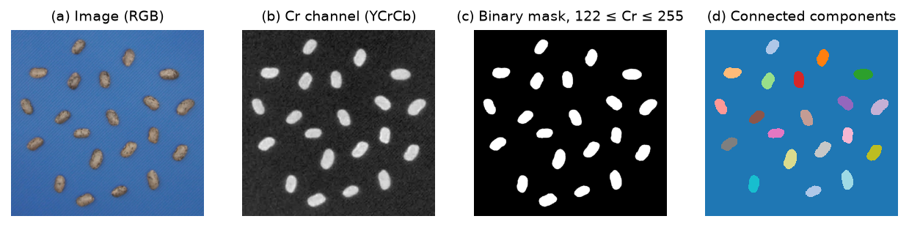
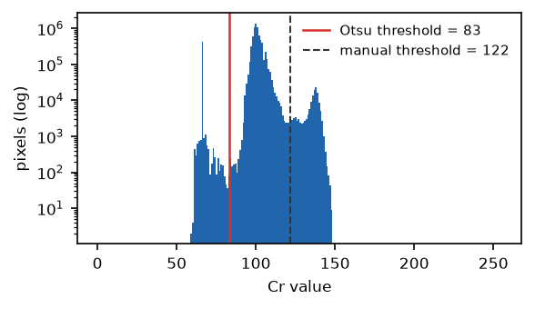

# 2. Segmentation

Segmentation separates objects from the background and produces a binary mask $B(x, y)$.

*Figure 2.1. (a) Seeds on a blue background. (b) The Cr channel of YCrCb separates the warm
seeds from the blue background. (c) Mask for 122 ≤ Cr ≤ 255. (d) 8-connected components.*

## 2.1 Color spaces

The photo (8-bit BGR) is converted to one of eight color spaces with OpenCV (Bradski, 2000):
BGR, HSV, CIELAB, YCrCb, HLS, CIE XYZ, YUV and CIELUV. One channel $I_c$ is used for the
threshold. The space used to segment is independent of the space used to report color
(section 6): segmentation only needs contrast between object and background.

## 2.2 Manual threshold

$$B(x, y) = \begin{cases} 1 & t_{min} \le I_c(x, y) \le t_{max} \\ 0 & \text{otherwise} \end{cases}$$

The interface shows the mask live over the photo while the user moves $t_{min}$ and $t_{max}$;
the same thresholds apply to every photo of the project (they belong to the capture setup).

## 2.3 Automatic threshold (Otsu)

Otsu's method (Otsu, 1979) chooses, for each photo, the threshold $t^*$ that maximizes the
between-class variance of the channel histogram:

$$t^* = \arg\max_t\ \omega_0(t)\,\omega_1(t)\,[\mu_0(t) - \mu_1(t)]^2$$

where $\omega_i$ and $\mu_i$ are the probability and mean of the two classes split at $t$.
Because the object class may be the bright or the dark one, the mask is inverted when more
than half of the image border falls in it (objects rarely cover the border; the background
does). The threshold found is exported as `otsu_threshold`.

*Figure 2.2. Histogram of the Cr channel of the same photo. Here Otsu splits off the dark
square in the corner (left mode), not the seeds (right mode): with an uneven background a
manual range is more reliable. This is why the manual threshold is the default.*

## 2.4 Analysis areas and excluded areas

The user can draw, per photo or for all photos, rectangles or polygons (coordinates stored
relative to the image size, 0–1). The mask keeps only the union of the analysis areas, minus
the excluded areas: $B \leftarrow B \land R_{incl} \land \lnot R_{excl}$.

## 2.5 Cleaning

Holes inside objects (e.g. a bright hilum) are filled when their area is smaller than
0.2 × the median area of the connected components; larger holes are kept, because they are
usually background enclosed by a ring of touching objects. Holes connected to the image
border are never filled. An optional morphological opening (3 × 3) removes thin protrusions.
