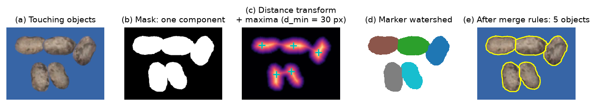

# 3. Objects

## 3.1 Labelling

Each 8-connected component of the mask is one object (Suzuki & Abe, 1985 for contour
tracing). This is used when objects do not touch ("Objects touch" off), which also keeps
irregular shapes such as flowers or leaves in one piece.

## 3.2 Separation of touching objects

When objects touch ("Objects touch" on), a component may contain several objects. They are
split with the distance transform and a marker-controlled watershed (Beucher & Meyer, 1993;
Soille, 2003; implemented with scikit-image, van der Walt et al., 2014), followed by rules that undo wrong cuts.

*Figure 3.1. Separation of touching seeds (synthetic clump made of real seeds from a test
photo). (a) Input. (b) The mask has two components. (c) Euclidean distance transform with its
local maxima, one per seed. (d) Watershed from the maxima. (e) Final objects after the merge
rules.*

**1. Distance transform.** $D(\mathbf{x}) = \min_{\mathbf{y} \notin B} \lVert \mathbf{x} - \mathbf{y} \rVert$
(Euclidean, 5 × 5 mask; Borgefors, 1986). Its maxima lie near the center of each object and
their value is the local half-thickness.

**2. Markers.** Local maxima of $D$ separated by at least $d_{min}$ px. By default
$d_{min} = \max(3,\ 0.9 \cdot \mathrm{median}(D(\text{maxima}_{5px})))$, i.e. about the typical
object radius, estimated from a first pass with $d_{min} = 5$. A maximum is kept only if
$D \ge 0.2 \cdot \max_{g} D$, where the maximum is taken within its own component $g$ (a large
object elsewhere in the photo does not hide the maxima of thin objects).

**3. Watershed.** The image $-D$ is flooded from the markers inside the mask.

**4. Shadows (light objects).** In clumps ≥ 1.6 × the median component area, dark pixels
(Otsu on CIELAB L* inside the mask) that touch the background and are either large
(≥ 0.1 × typical area) or line-like (bounding-box side² / area ≥ 4) are treated as shadows
between objects: the transform is computed without them, and parts separated by a shadow are
never merged again.

**5. Merge rules.** Watershed over-segments elongated or curved objects, so adjacent parts
$a$, $b$ are merged when:

- **Flat neck**: the saddle of $D$ on their common boundary is
  $\ge 0.9 \cdot \min(\max D_a, \max D_b)$ — there is no constriction between them.
- **No notches**: two touching objects leave a concavity (notch) at both ends of the contact
  line; a cut through a single object does not. The depth of each end of the cut inside the
  convex hull of $a \cup b$ is measured; if one end is shallower than
  $\max(2, 0.2\,\bar r)$ px ($\bar r$ = typical radius) and the neck is wide
  ($\ge 0.6$ of the thinner part's maximum of $D$), the parts are merged.
- **Small fragments**: parts smaller than 0.35 × the typical area of an isolated object are
  joined to the neighbor with which they share the longest boundary (tips of pods).
- **Single-object groups**: a component smaller than 1.5 × the typical area of an isolated
  object is not split at all.

**6. Splitting by notches.** Objects with area ≥ 1.6 × the median that remain whole (e.g. two
seeds side by side, which have a single ridge in $D$) are cut along a straight line between
two convexity defects (depth ≥ 0.25 $\bar r$), or between a defect and the opposite border.
Among all candidate cuts, the one maximizing

$$\text{score} = \min_k \mathrm{solidity}_k - 0.1 \sum_k \left|\frac{A_k}{A_1} - 1\right| - 0.01\,\frac{\ell}{\bar r}$$

is chosen ($A_1$: typical single-object area, $\ell$: cut length), and it is accepted only if
both parts are clearly more convex than the whole (solidity ≥ 0.85 and ≥ solidity of the
whole + 0.03). Up to three successive cuts are allowed.

Objects that came from a split clump are flagged `touching = 1`. They are counted, but by
default not measured (section 4), because part of their outline is an estimated cut.

**Validation status.** On a synthetic bank of real seeds pasted touching or overlapping,
separation is exact for touching seeds and loses ~10 % of objects in heavy overlaps; large pods
with a waist can still be split in two. These limits are reported in the paper; an AI model
is planned for heavily overlapping material.

## 3.3 Filters

- **Noise.** Objects smaller than $\min(10^{-4} H W,\ 0.05\,\tilde A)$ px are removed, where
  $\tilde A$ is the area-weighted median object area (many specks of noise do not lower it).
  Being relative, the rule does not depend on the photo resolution.
- **Border.** Objects touching the image border are excluded by default (they are cut).
- **Size filter (optional).** Minimum and maximum length and width (section 4), in the unit
  of the scale; 0 = no limit.
- **Manual exclusion.** Objects the user excludes in the inspector keep their number but are
  not counted or measured (`status = excluded`). The choice is stored as a point (relative
  coordinates) and re-applied when the photo is recomputed.

## 3.4 Numbering

Objects are numbered 1…n in reading order: row $= \mathrm{round}(y_c / \tilde h)$, with
$\tilde h$ the median bounding-box height, then by $x_c$ within the row. The number links the
object across the image, the tables and the export.
