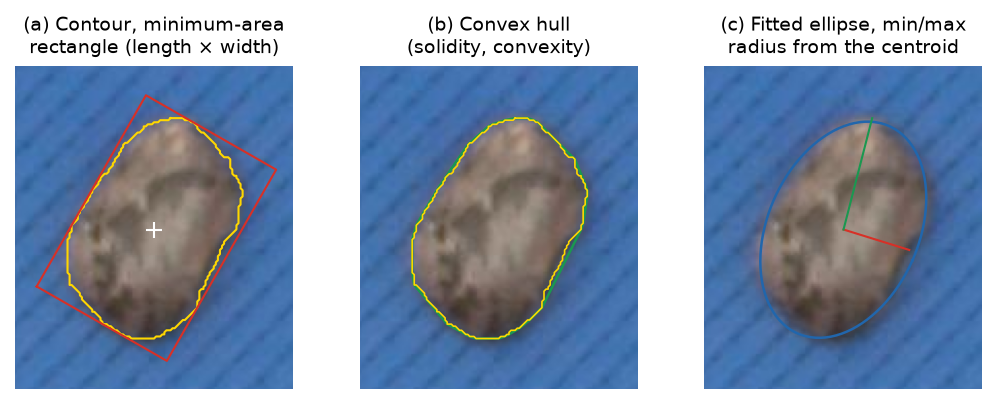

# 4. Morphometry (size and shape descriptors)

Descriptors are computed for each isolated object (objects with `touching = 1` are counted
but not measured unless "Measure touching objects" is on). The outer contour $C$ is traced
with Suzuki & Abe (1985) without approximation.

*Figure 4.1. (a) Contour (yellow), minimum-area rectangle (red) and centroid. (b) Convex
hull (green). (c) Least-squares ellipse, and the shortest (red) and longest (green) radius
from the centroid.*

## 4.1 Basic quantities

| Symbol | Definition |
|---|---|
| $A$ | Area: number of object pixels |
| $A_p$ | Polygon area of $C$ (shoelace formula); used in the ratios so that all terms come from the same polygon |
| $P$ | Perimeter: length of $C$ simplified with Douglas–Peucker, tolerance 1 px (Douglas & Peucker, 1973) |
| $H$ | Convex hull of $C$ (Sklansky, 1982), with area $A_H$ and perimeter $P_H$ |
| $L$, $W$ | Length and width: long and short sides of the minimum-area enclosing rectangle (Freeman & Shapira, 1975; rotating calipers, Toussaint, 1983) |
| $a$, $b$ | Major and minor axis (full lengths) of the least-squares ellipse fitted to $C$ (Fitzgibbon & Fisher, 1995) |
| $(\bar x, \bar y)$ | Centroid: mean of the object pixels |
| $r_i$ | Distance from the centroid to each contour point |

**Why the simplified perimeter.** The raw pixel contour follows the pixel staircase and
overestimates the perimeter of curved and oblique outlines by several percent. Simplifying with a
1 px tolerance removes the staircase while keeping the real shape.

**Length and width.** The minimum-area rectangle gives the length and width of the object in
any orientation, as with calipers. In the image they are drawn as the two axes through the
rectangle center.

## 4.2 Exported descriptors

Sizes are multiplied by $s$ (or $s^2$ for areas) and carry the unit in the column name.

| Column | Formula | Range | Interpretation |
|---|---|---|---|
| `area_<u>2` | $A\,s^2$ | > 0 | Projected area |
| `length_<u>`, `width_<u>` | $L\,s$, $W\,s$ | > 0 | Caliper length and width |
| `perimeter_<u>` | $P\,s$ | > 0 | Outline length |
| `aspect_ratio` | $L / W$ | ≥ 1 | 1 = as long as wide |
| `elongation` | $1 - W / L$ | [0, 1) | 0 = isometric |
| `circularity` | $\min(1,\ 4\pi A_p / P^2)$ | (0, 1] | 1 = disk (Cox, 1927; "form factor") |
| `solidity` | $A_p / A_H$ | (0, 1] | < 1 = concavities, notches |
| `convexity` | $\min(1,\ P_H / P)$ | (0, 1] | < 1 = rough or lobed outline |
| `rectangularity` | $A_p / (L W)$ | (0, 1] | 1 = rectangle; π/4 ≈ 0.785 = ellipse |
| `eccentricity` | $\sqrt{1 - (b/a)^2}$ | [0, 1) | Of the fitted ellipse; 0 = circle |
| `major_axis_<u>`, `minor_axis_<u>` | $a\,s$, $b\,s$ | > 0 | Ellipse axes |
| `radius_min/mean/max_<u>` | $\min r_i,\ \bar r_i,\ \max r_i$ (× $s$) | > 0 | Radii from the centroid |
| `radius_ratio` | $\min r_i / \max r_i$ | (0, 1] | 1 = round |
| `centroid_x_px`, `centroid_y_px` | $(\bar x, \bar y)$ | px | Position in the photo |

Definitions follow the usual image-analysis conventions (Russ & Neal, 2016), which are also
used by ImageJ (Schneider et al., 2012) and CellProfiler (Stirling et al., 2021), so the
values can be compared. Note that the ratios are dimensionless and do not depend on the scale.

## 4.3 Image-level values

| Column | Meaning |
|---|---|
| `n_objects` | Objects counted (manually excluded objects are not counted) |
| `n_touching` | Objects that came from splitting a clump |
| `n_measured` | Objects with morphometry |
| `n_excluded_manual`, `n_highlighted` | Objects excluded or highlighted in the inspector |

Summary statistics shown in the legends and charts are the arithmetic mean $\bar x$ and the
sample standard deviation (SD, $n - 1$ denominator).
