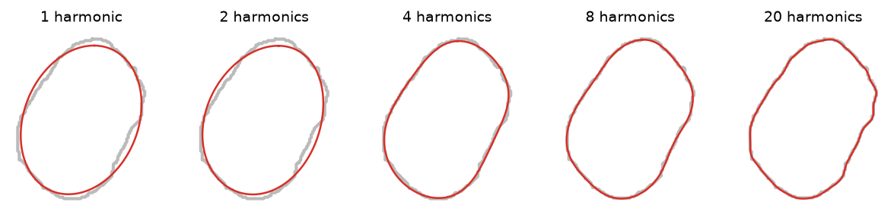

# 5. Outline shape: elliptic Fourier descriptors

Size descriptors (section 4) summarize the outline in a few numbers. To compare the outline
itself, FenotIT describes it with elliptic Fourier descriptors (EFD; Kuhl & Giardina, 1982),
the standard method for seed and leaf outlines in plant biology (Iwata & Ukai, 2002).

*Figure 5.1. Outline of a seed (gray) and its reconstruction (red) with 1, 2, 4, 8 and 20
harmonics. The first harmonic is always an ellipse; each further harmonic adds detail.
FenotIT uses 20 by default.*

## 5.1 Coefficients

The closed contour is a sequence of $K$ points. Let $\Delta x_p$, $\Delta y_p$ be the steps
between consecutive points, $\Delta t_p = \sqrt{\Delta x_p^2 + \Delta y_p^2}$,
$t_p = \sum_{j \le p} \Delta t_j$ and $T = t_K$ the perimeter. For harmonic $n = 1 \dots N$:

$$a_n = \frac{T}{2 n^2 \pi^2} \sum_{p=1}^{K} \frac{\Delta x_p}{\Delta t_p}\left[\cos\frac{2\pi n t_p}{T} - \cos\frac{2\pi n t_{p-1}}{T}\right]$$

$$b_n = \frac{T}{2 n^2 \pi^2} \sum_{p=1}^{K} \frac{\Delta x_p}{\Delta t_p}\left[\sin\frac{2\pi n t_p}{T} - \sin\frac{2\pi n t_{p-1}}{T}\right]$$

and $c_n$, $d_n$ the same with $\Delta y_p$. The outline is reconstructed as

$$x(t) = \sum_{n=1}^{N} a_n \cos\frac{2\pi n t}{T} + b_n \sin\frac{2\pi n t}{T},\qquad
y(t) = \sum_{n=1}^{N} c_n \cos\frac{2\pi n t}{T} + d_n \sin\frac{2\pi n t}{T}.$$

Objects whose contour has fewer than $2N + 2$ points are skipped.

## 5.2 Normalization

So that only shape is compared, the coefficients are made invariant to the starting point,
rotation and size with the first-harmonic ellipse (Kuhl & Giardina, 1982):

1. **Starting point.** $\theta_1 = \tfrac12 \arctan\dfrac{2(a_1 b_1 + c_1 d_1)}{a_1^2 - b_1^2 + c_1^2 - d_1^2}$; each harmonic is rotated in phase by $n\,\theta_1$.
2. **Rotation.** $\psi_1 = \arctan(c_1^* / a_1^*)$ of the phase-shifted first harmonic; all harmonics are rotated by $-\psi_1$, aligning the major axis of the first ellipse with $x$.
3. **Size.** All coefficients are divided by $|a_1^{**}|$, the semi-major axis of the first ellipse.

After normalization $a_1 = 1$, $b_1 = c_1 = 0$, and $|d_1|$ is the minor/major ratio of the
first ellipse. The $4N$ normalized coefficients are exported per object (`efd_a1 … efd_dN`,
table `object_shape`).

## 5.3 Alignment and mean shape

The normalization leaves two ambiguities that matter for seeds: a seed rotated 180° and a
seed seen from the other face (mirror image) give different coefficients. Within each group
that is compared (one photo, a batch or a genotype), every outline is replaced by whichever
of its four variants — identity, 180° rotation, and the two reflections — is closest
(Euclidean distance between coefficient vectors) to the current group mean. Starting from the
first object, the mean is updated and the choice repeated three times. The mean shape is the
arithmetic mean of the aligned coefficients.

**Difference from the mean.** For each object the inspector reports the Euclidean distance
between its aligned coefficients and the mean, $\delta = \lVert \mathbf{c} - \bar{\mathbf{c}} \rVert$,
next to the median $\delta$ of the photo, so atypical outlines (broken or deformed seeds)
stand out.

*Planned: principal component analysis of the coefficients (Iwata & Ukai, 2002) to describe
the main modes of shape variation and compare groups.*
