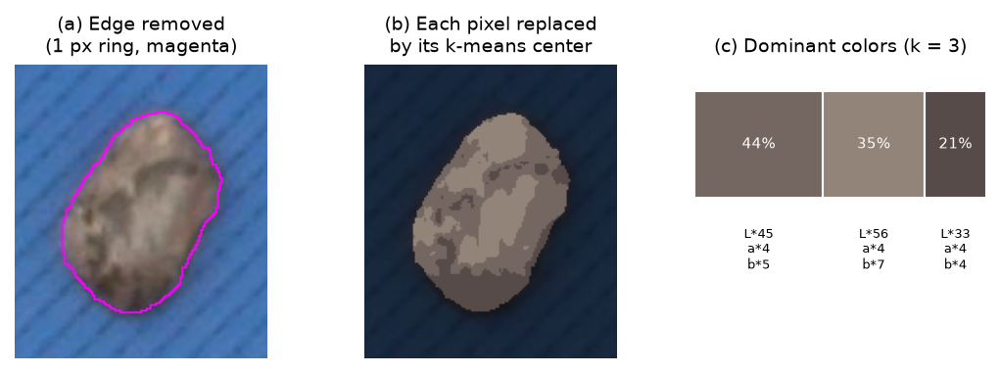

# 6. Color

*Figure 6.1. (a) The edge of the object (magenta) is removed before measuring color. (b) Each
remaining pixel replaced by its k-means center (k = 3). (c) Dominant colors with their share
of the object and their CIELAB coordinates.*

## 6.1 Pixels used

Pixels on the outline mix object and background, because of blur and demosaicing. A ring of
$e$ px is removed by erosion (3 × 3, $e$ iterations):

$$e = \mathrm{clip}\left(\mathrm{round}(0.015\sqrt{A}),\ 1,\ 3\right)$$

The ring depends on the optical blur (1–3 px), not on object size, so it stays small even
for large leaves. If fewer than 20 pixels remain, the whole object is used. Manually excluded
objects are skipped.

## 6.2 Mean color

The mean color is the arithmetic mean of the remaining pixels in RGB (`mean_R/G/B`), also
reported in CIELAB (`mean_L/a/b`).

## 6.3 Dominant colors (k-means)

Pixels are clustered in RGB with k-means (Lloyd, 1982) initialized with k-means++
(Arthur & Vassilvitskii, 2007): 3 restarts, at most 300 iterations, tolerance $10^{-3}$, fixed
random seed. The model is fitted on a random sample of at most 3000 pixels per object, and then
every pixel is assigned to its nearest center. The clusters are ordered by their share of
pixels (`pct`, %). $k$ is set by the user (default 3 per object, 5 for whole images); if an
object has fewer distinct colors than $k$, fewer clusters are returned.

Two modes are available:

- **Of each object** (`object`): each object gets its own palette — best to describe the
  pattern of one object (e.g. a mottled seed).
- **All together** (`pooled`): one palette is fitted on the pixels of all objects of the photo,
  and each object is described by the share of every common color. Objects then become
  directly comparable (same colors, different proportions).

The palette of the whole photo (all objects pooled) is always exported (`image_colors`).

## 6.4 Color spaces for reporting

CIELAB (CIE, 2004) is the default space for reporting and plotting color, because Euclidean
distances in it are approximately proportional to perceived differences: $L^*$ is lightness
(0–100), $a^*$ the green–red axis and $b^*$ the blue–yellow axis. Conversion uses OpenCV with
the sRGB/D65 assumption; 8-bit values are rescaled to $L^* \in [0, 100]$ and $a^*, b^*$
centered on 0. The color charts also offer RGB (0–255) and HSV ($H$ 0–360°, $S$, $V$ 0–100).

Colors are only comparable between photos if the light and camera settings are constant or if
the photos were color-corrected with a card (section 1.3).

## 6.5 Color charts

- **2D**: one plane of the space; $a^*$–$b^*$ is the chromaticity diagram, plotted with equal
  axis scales so that distances are color differences.
- **3D**: the three axes, navigable.
- One point per color, per object or per photo. Object and photo points are drawn at the mean
  color (averaged in CIELAB, weighted by share) as pie markers whose sectors are the dominant
  colors and their shares. Point size is proportional to area share.
