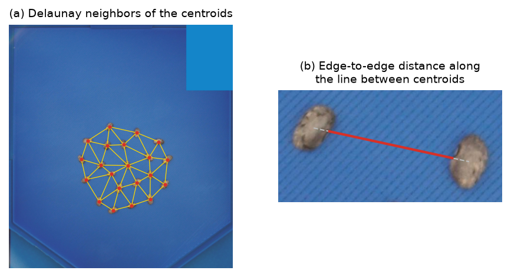

# 7. Spatial pattern: neighbor distances

The *Distances* analysis describes how objects are arranged: the free space between each
object and its neighbors, and whether the pattern is clustered, random or regular.

*Figure 7.1. (a) Neighbors defined by the Delaunay triangulation of the centroids. (b) The
default distance: free space between the two outlines along the line joining the centroids
(red); gray dashes are the parts inside the objects.*

## 7.1 Neighbors

Each object is represented by its centroid. Two definitions of neighbor are available:

- **Nearest** (`knn`): the $k$ nearest centroids (default $k = 5$), found with a k-d tree.
  Pairs are made symmetric (if $j$ is a neighbor of $i$, the pair $\{i, j\}$ is counted once).
- **Voronoi network** (`voronoi`): edges of the Delaunay triangulation of the centroids
  (Delaunay, 1934), i.e. objects whose Voronoi cells share a side. No parameter is needed.

## 7.2 Distance between two neighbors

| Option | Definition |
|---|---|
| Edge to edge (default) | Length of the part of the segment between centroids that lies outside both objects |
| Closest point | Minimum distance between the two outlines (nearest-neighbor search between contour points) |
| Center to center | Euclidean distance between centroids |

The center-to-center distance is always exported as well. A pair whose segment crosses a
third object is flagged (`crosses_object = 1`) and not drawn.

## 7.3 Per object and per photo

- Per object: `nearest_<u>` (distance to its closest neighbor), `mean_neighbor_<u>` and
  `n_neighbors`.
- Per photo: mean and SD of the nearest-neighbor distances, and the Clark–Evans index.

## 7.4 Clark–Evans aggregation index

With $n$ objects in an area $A$ (the analysis area if one was drawn, otherwise the whole
photo), density $\rho = n / A$, and $\bar r_A$ the observed mean distance from each centroid
to its nearest centroid (Clark & Evans, 1954):

$$\bar r_E = \frac{1}{2\sqrt{\rho}},\qquad R = \frac{\bar r_A}{\bar r_E},\qquad
z = \frac{\bar r_A - \bar r_E}{\sigma_E},\quad \sigma_E = \frac{0.26136}{\sqrt{n \rho}}$$

$R < 1$ indicates clustering, $R \approx 1$ a random (Poisson) pattern and $R > 1$ a regular
pattern (maximum 2.149 for a hexagonal lattice). The pattern differs from random at the 5 %
level when $|z| \ge 1.96$.

**Limitation.** No edge correction is applied (Donnelly, 1978): objects near the edge of the
area have their nearest neighbor farther away, which slightly inflates $R$ when $n$ is small.
Drawing the analysis area tightly around the objects reduces this bias.
